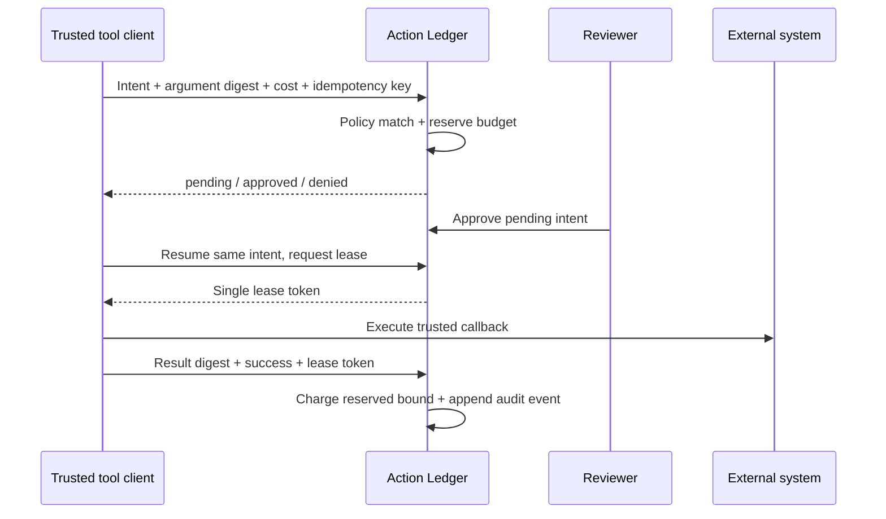

# Action Ledger

**A control room for consequential automation.**

Action Ledger sits between a software agent and the tools it can invoke. Before an action runs, it checks an exact operation/destination policy, reserves its declared cost, and requests independent review when required. A service client then obtains one execution lease and records a result digest.

The full-stack application includes a server-rendered dashboard, review queue, policy editor, budget overview, Bearer-authenticated JSON API, Python client and an OpenAI Responses tool dispatcher example. No model subscription or API key is needed to explore it.

## What you can do

- Deny actions by default; define exact operation/hostname policies without wildcard matching.
- Require a different reviewer for human-submitted actions.
- Bound cumulative spend with PostgreSQL-serialized reservations, including pending approvals.
- Resume the same intent with an idempotency key; reject changed arguments under that key.
- Issue a single execution lease; duplicate lease attempts never trigger the SDK callback.
- Cancel unleased requests and release their reservations.
- Inspect/export ordered audit events and verify the chained event digests.
- Integrate provider tool calls without storing raw tool arguments or results in the ledger.

## Try it locally

See [the operations guide](docs/OPERATIONS.md) for environment setup, Docker Compose, account provisioning and synthetic demo data. The demo seeds a pending invoice, a denied destination and a completed report. Sign in separately as the owner and reviewer to exercise independent review.

```sh
uv sync --locked
# Set APP_DEBUG=1 and a generated APP_SECRET_KEY as documented.
uv run python manage.py migrate
uv run python manage.py bootstrap_workspace "Operations" owner
uv run python manage.py add_member 1 reviewer reviewer
uv run python manage.py runserver 127.0.0.1:8000
```

## How it works



Read [architecture and trust boundaries](docs/ARCHITECTURE.md), [the API reference](docs/API.md) and [operations](docs/OPERATIONS.md).

## Verification and maturity

This is an initial production-oriented implementation. It includes tenant-scoped authorization, CSRF-protected browser actions, shared login throttling, CSP/security headers, hash-checked dependency locks, PostgreSQL tests, container packaging and CI configuration. It has not been independently audited or deployed with customer workloads. Gateway MFA, backup recovery exercises, image scanning and load tests remain deployment requirements.

**A cooperative client is essential.** The server does not sandbox tools, enforce a network destination after a lease, measure actual provider spend, or guarantee exactly-once external side effects. Trusted integrations must enforce the destination and cost bound. A process crash after execution requires reconciliation, never an automatic repeat. Hash chains do not prevent a database administrator from rewriting history.

```sh
make check
```

Development used Codex AI assistance. Review and verification details are recorded in `docs/VERIFICATION.md`. Original code remains private until the owner authorizes publication. No open-source license is granted at this stage.
